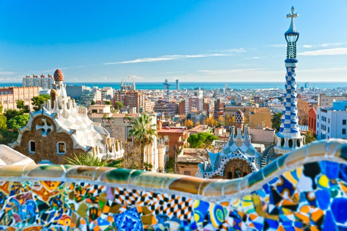

# Travelblog Extended

### Project Description

A simple vanilla (HTML,CSS,JavaScript) based travelblog where information about my travel experience is written about. This [blog](https://jileileen.de/travelblog/) motivated my **a lot** :-)

My favorite experience was here:

### Installation
Just `git clone` and start with the `index.html` with VS-Code Live-Server on Windows.

### Features
* About Page
* Hotel Booking Page
  